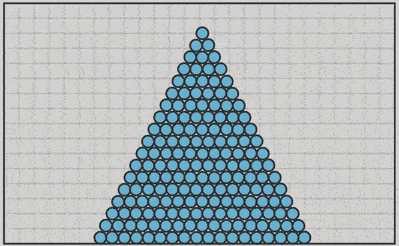

# ballpit-sim-2d

https://ballpit-sim-2d.netlify.app/

# about  

in September 2021, i attempted a fluid simulation with particles only.  
it turned out not as fluid as i'd hoped so now it's a ballpit simulation instead.  

in the lower gif, i tried to make the particles slightly attractive.  
notice how they form small clumps.  